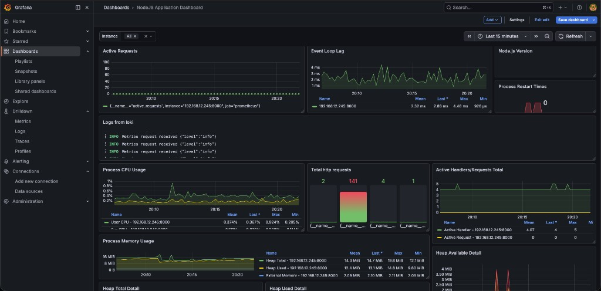

# Ops Dashboard — Monitoring with Prometheus, Grafana & Loki

A Node.js Express application instrumented with **Prometheus** for metrics, **Grafana** for dashboards, and **Loki** for centralized logging.

### Example Dashboard



---

## Prerequisites

- Basic knowledge of **Node.js** and **Express** framework
- Basic to intermediate knowledge of **Docker** and containerization
- [Docker](https://www.docker.com/) installed and running
- [Node.js](https://nodejs.org/) + npm installed

---

## Installation and Setup

### 1. Clone and Install

```bash
git clone https://github.com/JayeshDevre/Ops-Dashboard.git
cd Ops-Dashboard
npm install
```

### 2. Setup Prometheus

Create a `prometheus-config.yml` file and add the following configuration. Replace `<NODEJS_SERVER_ADDRESS>` with the actual address of your Node.js app.

```yaml
global:
  scrape_interval: 4s

scrape_configs:
  - job_name: prometheus
    static_configs:
      - targets: ["<NODEJS_SERVER_ADDRESS>"]
```

> **Tip:** Use `localhost:8000` if running everything on the host, or `host.docker.internal:8000` if Prometheus runs inside Docker and the Node app runs on the host.

Start the Prometheus server using Docker Compose:

```bash
docker-compose up -d
```

Prometheus is now up and running at [http://localhost:9090](http://localhost:9090).

Verify the scrape target status at [http://localhost:9090/targets](http://localhost:9090/targets).

### 3. Setup Grafana

```bash
docker run -d -p 3000:3000 --name=grafana grafana/grafana-oss
```

Grafana is now running at [http://localhost:3000](http://localhost:3000) (default login: `admin` / `admin`).

### 4. Setup Loki

```bash
docker run -d --name=loki -p 3100:3100 grafana/loki
```

Verify Loki is ready:

```bash
curl http://localhost:3100/ready
```

---

## Running the App

```bash
npm start        # production
npm run dev      # development (with nodemon)
```

The app runs at [http://localhost:8000](http://localhost:8000).

### Available Routes

| Route | Description |
|-------|-------------|
| `GET /` | Quick health check response |
| `GET /slow` | Simulates a heavy task (random delay, sometimes throws errors) |
| `GET /metrics` | Prometheus metrics endpoint |

---

## Configure Grafana Data Sources

Once Grafana is running, add these data sources:

**Prometheus**
- URL: `http://localhost:9090` (or `http://host.docker.internal:9090` from Docker)

**Loki**
- URL: `http://localhost:3100` (or `http://host.docker.internal:3100` from Docker)

---

## Metrics & Queries

### PromQL Examples

```promql
up
nodejs_version_info
process_resident_memory_bytes
irate(process_cpu_user_seconds_total[2m]) * 100
```

### Custom App Metrics

| Metric | Type | Description |
|--------|------|-------------|
| `http_requests_total` | Counter | Total HTTP requests |
| `http_request_duration_seconds` | Histogram | Request duration in seconds |
| `heavy_tasks_completed_total` | Counter | Heavy tasks completed (success/error) |
| `heavy_tasks_failed_total` | Counter | Heavy tasks that failed |
| `heavy_task_duration_seconds` | Histogram | Duration of heavy tasks |
| `active_requests` | Gauge | Requests currently in progress |

### LogQL Examples

```logql
{}                                    # all logs
{level="error"}                       # error logs only
count_over_time({level="info"}[5m])   # log count over time (for time series panels)
```

> **Note:** Loki queries return log lines (strings). Use **Logs** or **Table** visualization in Grafana. For **Time series** panels, use metric queries like `count_over_time(...)`.

---

## Generate Test Traffic

```bash
curl http://localhost:8000/
curl http://localhost:8000/slow
```

---

## Troubleshooting

| Problem | Solution |
|---------|----------|
| Grafana shows "No data" for Loki | Use **Logs** visualization, increase time range to **Last 1 hour**, verify Loki is ready with `curl http://localhost:3100/ready` |
| Prometheus target is DOWN | Verify the Node app is running on port 8000 and the target host in `prometheus-config.yml` is reachable from Prometheus |
| Loki returns 404 at root URL | This is normal — Loki is an API server. Use `/ready` or `/metrics` to check health |

---

## Tech Stack

- **Runtime:** Node.js + Express
- **Metrics:** Prometheus + prom-client
- **Logging:** Winston + winston-loki → Loki
- **Visualization:** Grafana
- **Containerization:** Docker / Docker Compose
